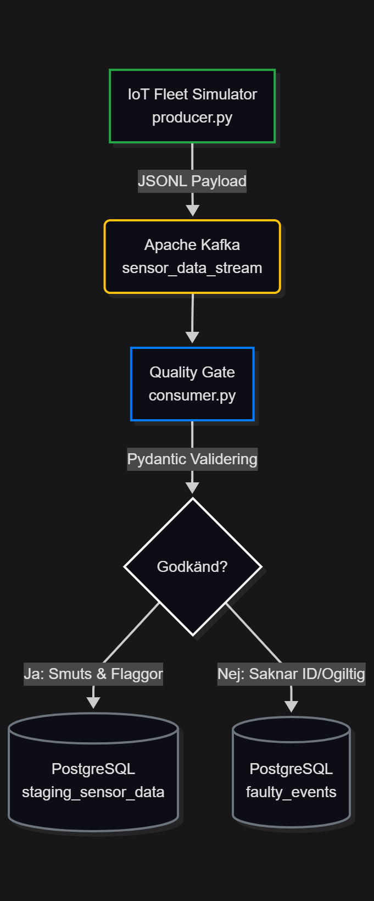

# Module Overview: Bronze Layer (Ingestion & Staging)
- producer.py **(Johnny)**
- consumer.py **(Indira)**

## Sammanfattning:

Bronze lagret är det första stoppet i vår Medallion arkitektur. Syftet med detta lager är att på ett tillförlitligt sätt generera, strömma, validera och spara raw data från våra IoT-sensorer (vitvaror). Fokus ligger på hög feltolerans och säker lagring, där vi bevarar datans ursprungliga skick för att möjliggöra asynkron tvätt och transformering i det kommande Silver lagret.

## Arkitektur & Dataflöde:

Dataflödet i Bronze lagret är händelsestyrt (Event Driven) och består av tre huvudkomponenter:

1. **IoT Fleet Simulator (`producer.py`)** -> Skapar och skickar data.
2. **Message Broker (`Kafka`)** -> Hanterar dataströmmen asynkront.
3. **Quality Gate (`consumer.py`)** -> Validerar och sparar ner datan.

---
## Argument för syntetisk data VS data hämtad ifrån externt API.
**Varför syntetisk data är bättre i labb syfte:**
- Vi gjorde valet att producera och använda oss av syntetisk data i denna labb. Det handlar inte om att undvika jobb utan om att **kontrollera "experimentet"** så att vi kan bevisa att pipeline + datakvalitet fungerar. Detta genom:

1. **Reproducerbarhet (det viktigaste i en labb)** 
    * Med syntetisk data kan ni köra samma scenario om och om igen och få jämförbara resultat.

    * Ett externt API kan ändra payload utan förvarning, ge olika data beroende på tid, eller börja rate limit'a när ni demar eller behöver mer data för test.

    * Reproducerbarhet gör att vi kan skriva tester, valideringsregler och 'expected outcomes'.

2. **Full kontroll över datakontraktet (schema, typer, edge cases)**
    * Vi bestämmer exakt vilka fält som finns, vilka som är obligatoriska och vilka som får vara null.

    * Vi kan medvetet injicera problem som är relevanta för medallion: saknade nycklar, fel datatyp, whitespace, inkonsekventa kategorier, extrema värden(Se producer.py för mer exempel)

    * Det ger ett tydligt 'varför' till Silver-lagrets existens: Silver kan bevisa att det kan städa och standardisera.

3. **Vi kan designa data för att visa värdet av data**  
Ett externt API råkar ofta inte ha "bra undervisningsdata" Med syntetiskt kan vi som grupp säkerställa:

    * historik per engine (stateful) -> möjliggör trend, slitage, prediktivt underhåll

    * realistiska affärssignaler (maintenance thresholds, temperaturvarningar, vibration) -> gör Gold/KPI meningsfullt

    * balanserad distribution (många normala event + lagom % av anomalies) -> dashboards visar inte bara att 'allt är rött'

4. **Stabilitet och demo säkerhet**  
Extern data kan orsaka problem som gör att planeringen för varje sprint ej håller. Vi kommer ej råka ut för:
    * Rate limits / throttling
    * Driftstörningar / downtime
    * Auth tokens som går ut.
    * API versioner som ändras.
    * Närverksproblem (DNS, HTTP/HTTPS strul)

5. **Integritet, etik och juridik**
    * Det finns **INGEN** risk att råka hantera persondata eller känslig data (GDPR/PII)
    * Lättare att dela repo, loggar och sample data med lärare eller elever i klassen utan att behöva spendera väldigt mycket tid på att "scrubba data".

## Komponentbeskrivning:

### 1. Data Generator (`producer.py` -> Johnny)

Den här modulen agerar som vår Source of Data. För att simulera en verklig IoT-miljö använder vi inte helt slumpmässig data vid varje iteration, utan vi har byggt en **Stateful Fleet Simulator**.

* **The Fleet:** Vid uppstart skapas en statisk flotta på 4000 unika maskiner (Washing Machines, Dryers, etc) i minnet.

* **Tidslinjen:** Skriptet loopar genom flottan och "spolar fram tiden" (1–12 timmar åt gången) för att säkerställa att `run_hours` och `timestamp` alltid ökar logiskt för varje `engine_id`. Det här möjliggör historisk analys av slitage.

* **Chaos Engineering:** Skriptet injicerar medvetet tre typer av avvikelser i dataströmmen (ca 20-40% sannolikhet som **vi** bestämmer):
* *Tekniska Fel:* Saknade IDn, offline-sensorer, `Null`-värden.
* *Affärslarm:* Extrema temperaturer, övervarvande motorer (RPM).
* *ETL-Smuts:* Formateringsfel (whitespaces i siffror `"  1450.5  "`) och inkonsekventa kategorinamn `"WASHING MACHINE "`. Detta simuleras för att testa vårt Silver-lagers tvättkapacitet.

* **Cold Storage:** All data loggas även till en lokal JSONL-fil (`raw_sensor_data.jsonl`) som en failsafe och vår **Source of Truth**.

### 2. Message Broker (Apache Kafka)

Datan publiceras till Kafka-topicen `sensor_data_stream`. Kafka säkerställer att vi kan hantera plötsliga spikar i datavolymen utan att databasen överbelastas, samt att Consumer(Indira) och Producer(Johnny) är helt frikopplade (Decoupled).

### 3. Quality Gate & Ingestion (`consumer.py` -> Indira)

Consumern prenumererar på Kafka-topicen och agerar 'bouncer' innan datan når databasen.

* **Pydantic Validering:** Koden använder Pydantic för att säkerställa att inkommande JSON innehåller nödvändiga nycklar och rätt datatyper (strict type checking).

* **Business Logic Flags:** Consumern räknar ut varningsflaggor i realtid (t.ex. `MAINTENANCE_WARNING` vid 4000h eller `TEMP_WARNING` över 101C)

* **Routing:** *Godkänd data:* Skickas till Staging tabellen.
* *Kritisk / Korrupt data:* Fångas upp av Exception-hanteringen och skickas till en Dead Letter Queue **(DLQ)**

### 4. Storage (PostgreSQL)

Vi använder två separata tabeller i vår databas för Bronze lagret:

* **`staging_sensor_data` (The Landing Zone):** Sparar all godkänd data. *Notera:* Själva payloaden sparas i en `TEXT`-kolumn (snarare än `JSONB` eller uppackade kolumner). Detta garanterar att den ostrukturerade rådatan, inklusive genererad "ETL-smuts", överlever hela vägen in i databasen för att senare hanteras av vårt Pandas-team i Silver-lagret. Larmflaggorna sparas i separata kolumner.

* **`faulty_events` (Dead Letter Queue):** Hit skickas data som misslyckades i Pydantic-valideringen (t.ex saknar `engine_id` eller har fel format som kraschar JSON-parsingen) Här sparas även felmeddelandet från Pydantic för framtida felsökning.

---

